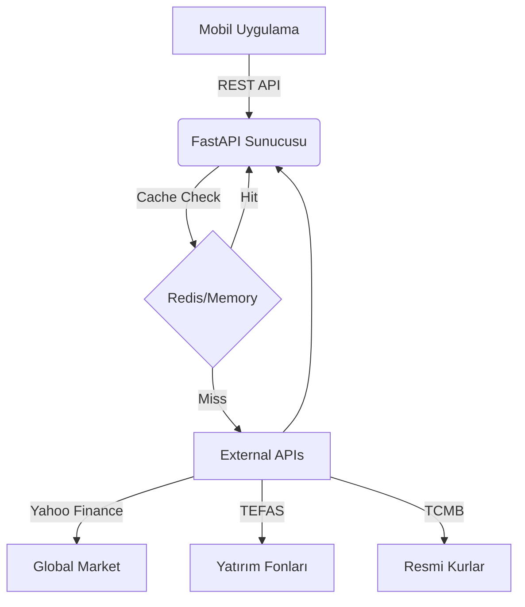

# InvestGuide Veri Kaynakları ve API Yol Haritası

Bu belge, InvestGuide uygulamasının finansal verilerini sağlayan backend servisinin veri kaynaklarını ve entegrasyon yöntemlerini tanımlar.

## 1. Genel Bakış

Sistem, ücretsiz ve limitli kaynakları (Yahoo Finance, TEFAS, TCMB) bir araya getirerek önbelleklenmiş (cached) bir REST API sunar. Amaç, mobil uygulamanın doğrudan veri kaynaklarına gidip engellenmesini önlemek ve veriyi tek bir formatta sunmaktır.

## 2. Veri Kaynakları Detayı

### A. Global Piyasalar (Döviz, Emtia, Kripto, Endeksler)
Bu veriler `yfinance` kütüphanesi aracılığıyla Yahoo Finance'den çekilir.

| Varlık | Sembol (Ticker) | Açıklama | Güncelleme Sıklığı |
| --- | --- | --- | --- |
| **Altın (Ons)** | `GC=F` | Global altın fiyatı ($) | 1 Dakika |
| **Gümüş** | `SI=F` | Global gümüş fiyatı ($) | 1 Dakika |
| **Dolar/TL** | `USDTRY=X` | Anlık kur | 1 Dakika |
| **Euro/TL** | `EURTRY=X` | Anlık kur | 1 Dakika |
| **Bitcoin** | `BTC-USD` | Kripto para | 30 Saniye |
| **Ethereum** | `ETH-USD` | Kripto para | 30 Saniye |
| **S&P 500** | `^GSPC` | ABD Borsası | 5 Dakika (Piyasa saatlerinde) |
| **Nasdaq** | `^IXIC` | Teknoloji Borsası | 5 Dakika |
| **Brent Petrol**| `BZ=F` | Petrol fiyatı | 5 Dakika |

**Hesaplanan Veriler:**
- **Gram Altın (TL):** `(Ons Fiyatı / 31.1035) * Dolar Kuru` formülü ile sunucu tarafında hesaplanır.

### B. Yatırım Fonları (Türkiye)
TEFAS verileri `tefas-crawler` kütüphanesi ile çekilir.

| Veri Tipi | Kaynak | Yöntem | Güncelleme Sıklığı |
| --- | --- | --- | --- |
| **Fon Fiyatı** | TEFAS | `tefas-crawler` | Günlük (Akşam 18:00 sonrası) |
| **Fon Getirileri** | TEFAS | `tefas-crawler` | Günlük |
| **Fon İçeriği** | KAP / TEFAS | Scraping (Future Plan) | Aylık |

### C. Resmi Kurlar (TCMB)
Resmi işlemler ve arşiv için TCMB verileri kullanılır.

| Veri Tipi | Kaynak | Yöntem | Güncelleme Sıklığı |
| --- | --- | --- | --- |
| **Gösterge Kurlar** | TCMB XML Servisi | XML Parsing (`requests` + `xml`) | Günlük (15:30) |

### D. Borsa İstanbul (BIST)
Yahoo Finance genellikle BIST verilerini 15-20 dakika gecikmeli verir.

| Varlık | Sembol | Açıklama | Not |
| --- | --- | --- | --- |
| **BIST 100** | `XU100.IS` | Endeks | Gecikmeli |
| **THY** | `THYAO.IS` | Hisse Senedi | Gecikmeli |

## 3. Gelecek Planları (Roadmap)

### Faz 1: Temel Veriler (Şu anki Durum)
- [x] Yahoo Finance entegrasyonu (Global)
- [x] TCMB Kurları (Resmi)
- [x] TEFAS Fon Fiyatları (Basit)
- [x] FastAPI Kurulumu ve Cache Yapısı

### Faz 2: Gelişmiş Entegrasyonlar
- [ ] **BES Fonları (BEFAS):** `tefas-crawler` kütüphanesi BEFAS verilerini desteklemiyor olabilir. Bunun için `https://www.befas.gov.tr` üzerinden scraping yapılacak bir servis yazılacak.
- [ ] **Kripto Detay (CoinGecko):** Yahoo Finance yerine daha detaylı kripto verisi için CoinGecko Free API entegre edilecek (Hacim, Piyasa Değeri vb. için).

### Faz 3: Kullanıcı Özelleştirmeleri
- [ ] **Portföy Takibi:** Kullanıcının elindeki varlıkları sunucuda şifreli tutarak, toplam portföy değerini hesaplayan endpointler.
- [ ] **Fiyat Alarmı:** Belirli bir seviyeye gelen varlıklar için mobil bildirimi tetikleyecek arka plan servisi (Background Worker).

## 4. Teknik Mimari

